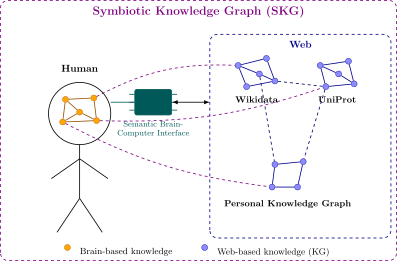

## Scientific challenges
{:#challenges}

The Semantic Web vision has successfully enabled making knowledge interoperable among machines, which can aid human objectives.
Our next big challenge is to make such semantic knowledge interoperable with human cognition itself, to directly augment human intelligence.
To augment human intelligence, we propose working towards an integration of human and artificial intelligence.
As shown in , we foresee the creation of *Symbiotic Knowledge Graphs* (SKGs),
which consist of the integration of human knowledge stored in the brain, and external knowledge stored on the Web.
To achieve this, the Semantic Web stack already offers important building blocks,
such as RDF to represent formal knowledge, and SPARQL to retrieve knowledge.
On the one hand, this allows humans to directly access external knowledge.
And on the other hand, this enables external processes or other humans to access knowledge of other humans.
Furthermore, this provides the basis for human cogniton to make use of symbolic reasoning over this integration.

<figure id="symbiotic-kg">

<figcaption markdown="block">
A *Symbiotic Knowledge Graph* (SKG) is the integration of a *Brain-based Knowledge Graph* (BKG) with external Knowledge Graphs.
For this, a *Semantic Brain-Computer Interface* (SBCI) provides the connection point between the two worlds.
This enables information to be virtually interlinked across this neural-digital boundary,
as a foundation for co-evolving human and artificial intelligence.
</figcaption>
</figure>

This vision can be positioned within the research field of [Human Cognitive Augmentation](cite:cites neurotechnologieshumancogaug),
which focuses on using technology to enhance human mental capabilities (e.g. memory, focus, and decision-making).
While conventional **Human-Computer Interfaces** (HCIs) (e.g. touch screens, augmented reality devices) could be used that provide actionable information when needed,
they still require indirectly interfacing through a sensory organ (e.g. eyes, skin, ...).
In contrast, **Brain-Computer Interfaces** (BCIs) (e.g. Neuralink) are more invasive and directly stimulate the brain through electrical or magnetic currents.
While Knowledge-Graph-based HCIs are already commonplace within our society (e.g. Google Lens, IKEA Place, Microsoft HoloLens),
the integration of Knowledge Graphs are BCIs remain unexplored.
As BCIs bypass conventional sensory and motor pathways, they may ultimately enable tighter and higher bandwidth integration between humans and computational systems than is possible with HCIs.

Hereafter, we provide a high-level roadmap that spans several research fields to achieve this vision.
Concretely, we first discuss which opportunities already exist within current BCI technology to create *Semantic Brain-Computer Interfaces* (SBCIs).
Next, we discuss which future advancements would be needed in BCI technology to fully realize the potential of SBCIs.

### Current challenges and opportunities for SBCIs

[Human cognition is defined as the mental framework that is responsible for acquiring, storing, transforming, and using information](cite:cites cognitivepsychology).
Within [cognitive architectures](cite:cites actr,soar), this stored information is considered the foundation for intelligence.
As such, the ability to integrate external knowledge into human cognition forms is an important basis for augmenting human intelligence.
To enable this integration, there is a need for the creation of *Semantic Brain-Computer Interfaces* (SBCIs),
which are interfaces that can encode and decode human knowledge,
so it can be interlinked and interact with formal knowledge (e.g. RDF).

The field of cognitive neuroscience studies how cognitive processes such as memory are implemented in the brain.
The current state of the art of cognitive neuroscience and BCIs are capable of encoding and decoding sensory-related information such as
[converting sound into electrical stimulation of auditory nerve](cite:cites cochlearimplants),
[attempted handwriting movements and converting them to text](cite:cites braintotext),
[reconstructing visual images from measured brain activity](cite:cites imagereconstruction),
or even ongoing work to [directly enable vision](cite:cites blindsight).
However, arbitrary memories or thoughts can not yet be encoded or decoded.
but [semantic features of stimuli (e.g. story telling) can be measured](cite:cites semanticmaps),
such as knowing whether or not something induces fear, or is related to food.

For interfacing human cognition with formal knowledge models such as RDF,
this means that immediate opportunities exist involving human senses and actuators.
This includes making external knowledge directly visible or audible to humans through electrical stimulation,
or movement-based exploration and manipulation of external knowledge.
Furthermore, there are opportunities for automatic human-specific sentiment extraction of external events.
For this, existing techniques from the field of HCIs can be reused,
such as Knowledge Graph Construction or the exploration of Knowledge Graphs through faceted search using visual stimuli and recorded handmovements from BCIs,
or entity linking between concepts and human sentiments.

To enable low-level data integration, we can build upon the [Semantic Sensor Network Ontology](cite:cites spec:ssn) that is designed for sensors, actuators, and the data they produce.
So far, no work has yet been done towards using this ontology to model human senses and actuators.
As such, we formulate the research question: ***"How can human senses and actuators be semantically modeled?"***
Solving this question will enable humans to directly produce RDF data to drive other processes,
for example to automatically adjust mechanical operations based on human actions in manufactoring environments.

To enable human-focused interaction,
we can incorporate semantic processes (e.g. faceted search, query execution, ...) into BCIs.
While current [BCIs already enable humans to control cursors on a screen by imagining hand movements](cite:cites braincursor),
no work has been done yet towards using BCIs for navigating Web sites or Knowledge Graphs.
The potential here is that the semantic meaning of hyperlinks and RDF predicates can be leveraged to increase navigation efficiency.
For this, we formulate the research question: ***"How can link semantics aid humans in navigating data graphs?"***

### Future challenges for SBCIs

The SBCI described above relies on what BCI technology can already achieve today.
In order to interlink complete memories and thoughts,
or to make external knowledge available as external memory,
more work is needed in the fields of cognitive neuroscience and BCIs.
As such, this section is speculative in nature,
and assumes specific breakthroughs in cognitive neuroscience and BCI technology
for the further advancement of SBCIs.

Currently, [the neural encoding of abstract concepts and complex knowledge relations is not well understood yet](cite:cites neurotechnologieshumancogaug).
Furthermore, [prosthesis techniques exist](cite:cites corticalprosthesis) for restoring or enhancing memory,
but externally stored memories can not yet be integrated into human cognition.
Additionally, current BCIs only have a [very limited information bandwidth](cite:cites bcis,noninvacivebcireview),
which would be necessary for exchanging complex structures such as large chunks of knowledge.
Once these barriers are resolved, we could have BCIs that are able to encode and decode memories.
To make this brain knowledge interoperable with external knowledge,
SBCIs will need to be able to encode and decode brain knowledge to and from RDF.
Since memories are not stored in a single place,
but [emerge from *semantic knowledge* that combines multimodal experiences](cite:cites semanticknowledge) (e.g. visual features, taste, smell, ...) that are personal,
different mappings may be needed to translate to and from RDF for different people.
As such, this may lead to the creation of a *Brain to RDF Mapping Language* (B2RML).
Concretely, the research question that must be tackled here is: ***"How can biological semantic memory be mapped to and from symbolic knowledge?"***
If we can solve this question,
we can advance from looking up information within Knowledge Graphs,
to actually *know* information stored in Knowledge Graphs.

Next to exchanging pure memories, there is also the potential to exchange *thoughts* and *reasoning*.
While symbolic and subsymbolic AI enables reasoning on digital knowledge,
the availability of brain knowledge could enable AI to also reason over brain knowledge.
As reverse, we may also see human reasoning over external knowledge.
In order to combine the two, where humans and machines can jointly reason over knowledge,
we may need a way to exchange reasoning contexts, such as a reasoning or proof language.
While languages such as [N3](cite:cites spec:n3) and [SHACL Rules](cite:cites spec:shacl-rules)
may offer a starting point,
it is unclear if human reasoning is sufficiently compatible with these languages.
Concretely, the research question that must be tackled here is: ***"How can biological reasoning be mapped to and from symbolic reasoning?"***
Solving this question will enable human reasoning capabilities to be increased using external (symbolic) reasoners.

Since human memories and thoughts are highly personal,
there are some great ethical concerns involved in these matters.
Privacy-concerning legislature such as GDPR would apply to SKGs,
since SKGs are personal in the sense that they can identify a person.
As privacy concerns around brain data are arguably greater than externally stored data about people,
SBCIs should make privacy concerns a high priority.
As such, SBCIs should have strong access control and consent mechanisms.
Related to this, we define a final research question: ***"How can we model ownership and access control for biological memories?"***.
Solving this question is a critical requirement before we can ethically deploy SBCIs in the real world.
