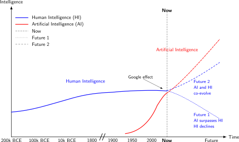

## Need to co-evolve human and artificial intelligence
{:#coevolving}

Since just a few decades ago, we started creating Artificial forms of Intelligence (AI),
[which are rapidly advancing](cite:cites aiintelligence).
Some argue that this AI [may soon match or exceed Human Intelligence (HI)](cite:cites aigeneralintelligence).
At the same time, humans increasingly offload cognitive tasks to external techical systems,
such as calculators, search engines, and AI chatbots,
which leads to automation-induced skill degradation, also known as [the *Google effect*](cite:cites googleeffect).
While there is an ongoing debate [whether or not human intelligence itself is declining](cite:cites reverseflynn),
the relative gap between individual human capability and increasingly capable AI is widening.
If these two trends continue, we may be evolving towards a future where AI surpasses HI (Future 1),
which leads to an uncertain future of humanity.
In this paper, we argue for the need of a course correction (Future 2),
where HI co-evolves with AI,
which can be considered a necessity due to biological evolution being much slower compared to our technological advancement.
 shows an illustration of this HI-AI co-evolution.

<figure id="evolution-intelligence">

<figcaption markdown="block">
Evolution of Human Intelligence (HI) and Artificial Intelligence (AI) over time,
with two possible futures where HI declines while AI continues to advance (Future 1), or HI and AI co-evolve (Future 2).
Axes are illustrative and non-empirical.
</figcaption>
</figure>
